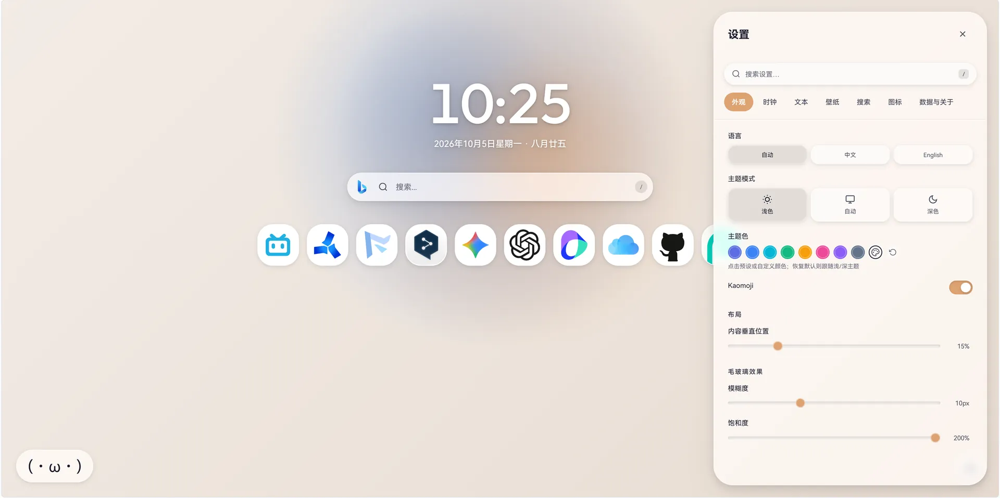

<p align="center">
  
</p>

<h1 align="center">Frostart</h1>

<p align="center">
  Frostart 是鸢做的一款可高度自定义的本地毛玻璃浏览器首页插件~
</p>

<p align="center">
  <a href="https://github.com/Gledery/frostart/releases/latest"></a>
  <a href="./LICENSE"></a>
  <a href="https://developer.chrome.com/docs/extensions/develop/concepts/manifest-files"></a>
  <a href="https://frostart.pages.dev/newtab"></a>
</p>

## 效果预览



## 这是什么

**Frostart** 是鸢做的一款可高度自定义的本地毛玻璃浏览器首页插件~

设计语言继承自我自己维护的 [PhasWer 小站](https://phaswer.pages.dev/)。这是我第一次写这种工具性的项目，所以肯定有各种问题，很期待大家的反馈OwO

## 功能列表

这里是此插件的主要的功能们：

### 视觉与主题

- 浅色 / 深色 / 跟随系统
- 中英双语，可手动指定或跟随系统语言
- 自定义主题色（accent），渐变预设可联动主题色
- 四种壁纸模式：渐变 / 纯色 / 图片上传 / 必应每日壁纸
- 自定义渐变颜色和角度
- 派生光斑（根据背景色计算，低饱和背景也能有光斑）
- 壁纸颜色变量用 `@property` 注册为类型化属性，切换时可插值平滑过渡

### 时钟

- 12 / 24 小时制，可显示秒、星期、农历
- 时钟字体与正文字体分开设置
- 右键时钟：复制时间 / 切时制 / 切显示秒

### 搜索

- 18 个内置引擎
- 自定义引擎，URL 里用 `%s` 当关键词占位
- 点搜索框左侧的引擎图标可快捷切换
- 按 <kbd>/</kbd> 聚焦搜索框

### 快捷方式

- 拖拽排序（FLIP 动画）
- 图标支持上传图片 / SVG / 自动抓取 favicon（DuckDuckGo 接口）
- 图标编辑器：缩放、平移、独立背景色
- 右键菜单：编辑 / 新标签打开 / 删除

### 设置面板

- 七个分区：外观 / 时钟 / 文本 / 壁纸 / 搜索 / 图标 / 数据与关于
- 设置项搜索（抽屉打开时按 <kbd>/</kbd>），点击结果直接定位
- 所有改动实时生效
- 配置导出 / 导入 / 恢复默认
- 自动检查更新（读 GitHub Releases，只有正式发布的 Release 才会被识别）

### 彩蛋

- **角落 Kaomoji**：一只等待开智的Kaomoji

## 在线体验

打开 [frostart.pages.dev/newtab](https://frostart.pages.dev/newtab) 即可预览最新稳定版，无需安装，功能与扩展版一致

> [!NOTE]
> 线上版本只跟踪正式 Release；main 分支上的开发版不会上线。网页版"数据与关于"里的"下载安装包"拉取的是 GitHub 最新 Release 的资产

## 安装

### 方式一：从源码加载（既然你都已经在这里了。。。）

1. Clone 或下载本仓库
2. 打开 `chrome://extensions/`
3. 右上角点击开启开发者模式
4. 点「加载已解压的扩展程序」，选仓库根目录
5. 开个新标签页就能看到了

> Edge / Brave / Vivaldi / Arc 等 Chromium 系浏览器应该也能用，没全部测过

### 方式二：下载正式安装包

在 [Releases 页面](https://github.com/Gledery/frostart/releases/latest) 下载最新版资产（优先手动上传的安装 ZIP，源码 ZIP 兜底），解压后按方式一的步骤 2–5 加载；也可以在[在线网页版](https://frostart.pages.dev/newtab)的「数据与关于」里点「下载安装包」直接获取

> [!TIP]
> 如果下载的是源码 ZIP，加载时要选包含 manifest.json 的内层文件夹

## 更新

由于插件以已解压的扩展程序方式加载，Chrome 不会自动更新，需要手动替换文件：

1. 打开新标签页时会自动检查 GitHub Releases（每 6 小时一次），有新版本时版本号旁会出现徽章，设置图标上也会有小红点
2. 也可以在「设置 → 数据与关于」里点「检查更新」手动检查
3. 点徽章跳到 Release 页面，下载新版本的安装包
4. 解压并用新文件替换旧的扩展目录（或放一个新目录）

> [!NOTE]
> 配置保存在 `chrome.storage.local`，更新代码不会丢失设置

## 项目结构

```
Frostart/
├── manifest.json          # MV3 清单
├── newtab.html            # 新标签页（扩展主页面）
├── changelog.html         # 更新日志
├── converter.html         # iTab ⇄ Frostart 转换工具（独立网页，不属于扩展页面）
├── index.html             # 落地页
├── css/
│   ├── tokens.css         # 设计令牌（@property / 主题变量）
│   ├── base.css           # 重置 / 壁纸系统 / 玻璃效果
│   ├── components.css     # 组件层
│   └── pages.css          # 页面专属样式
├── js/
│   ├── i18n.js            # 中英双语字典与语言切换
│   ├── settings.js        # 配置管理（防抖保存 / 迁移 / 备份）
│   ├── wp-cache.js        # 首屏壁纸缓存
│   ├── services.js        # 公共服务层
│   ├── page-theme.js      # 子页面主题同步
│   ├── changelog.js       # 版本数据与日志渲染
│   ├── core.js            # 应用骨架
│   ├── sliders.js         # 滑块系统
│   ├── panels.js          # 设置面板
│   ├── widgets.js         # 快捷键 / 右键菜单 / 拖拽 / 图标编辑器
│   ├── packager.js        # 开发环境自打包
│   ├── kaomoji.js         # 角落颜文字
│   └── utils/             # 数学 / 字符串 / 色彩 / 字体 / 版本工具函数
├── icons/                 # 扩展图标与内置引擎图标
├── docs/                  # 文档用图片
├── PRIVACY.md             # 权限与隐私说明
└── LICENSE                # GPL-3.0
```

## 技术栈

使用的包括原生 JS，CSS Custom Properties + `@property` + `backdrop-filter`，Canvas 压图和 FLIP 动画。

之所以不上框架，一是插件就这么大没必要，二是想保持代码可直接阅读，这样想抄哪段直接拿走就行（只要遵守 GPL-3.0协议都欢迎）。

### 浏览器兼容性

基于 Manifest V3，只支持 Chromium 内核浏览器，最低版本要求 Chrome **88+**：

| 浏览器 | 状态 | 说明 |
| --- | --- | --- |
| Chrome | ✅ 主要测试环境 | 88+ |
| Edge | ✅ 已测 | Chromium 内核，88+ |
| Brave | 🟢 应该可用 | 未深度测试 |
| Vivaldi | 🟢 应该可用 | 未深度测试 |
| Arc | 🟢 应该可用 | 未深度测试 |
| Firefox | 🟡 未适配 | 已支持 MV3，但未做兼容与测试 |
| Safari | 🟡 未适配 | 需另写 Safari Web Extension |

> 权限相关的说明写在 [PRIVACY.md](./PRIVACY.md) 里

---


## 隐私

**此插件不收集任何数据**，详见 [PRIVACY.md](./PRIVACY.md)

## 贡献与联系

非常欢迎反馈 bug、提建议或直接贡献代码，约定请看 [CONTRIBUTING.md](./CONTRIBUTING.md)

也可以直接 [B 站私信](https://space.bilibili.com/3461577804089941) 找我

## 协议

[GPL-3.0](./LICENSE) © 灰鸢 Gledery

---

<p align="center">
  © 灰鸢 Gledery 闲的没事用肝创建 (。・ω・。)<br>
  你滑到底了哇，去喝杯水吧~
</p>
